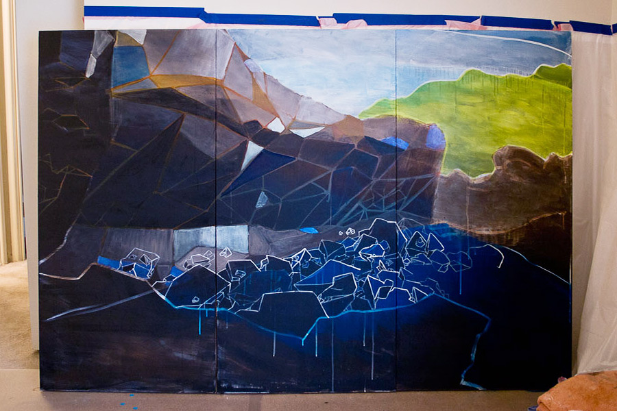
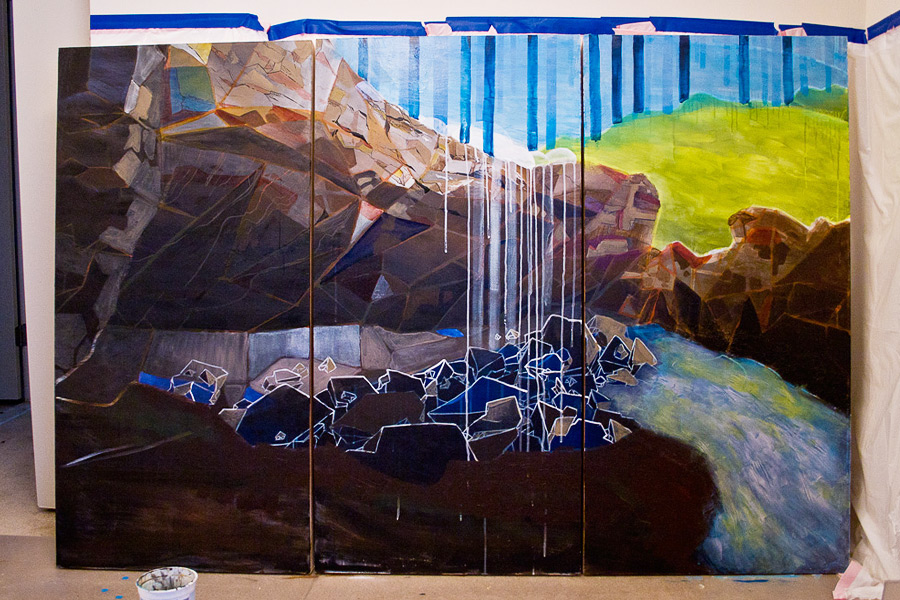
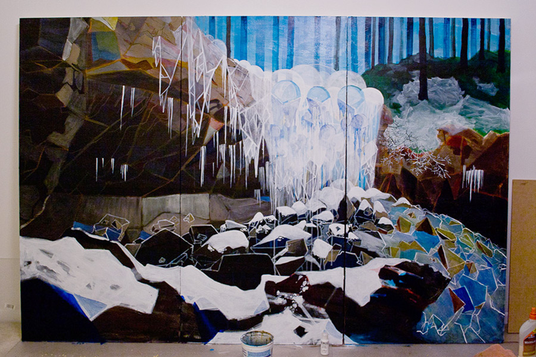
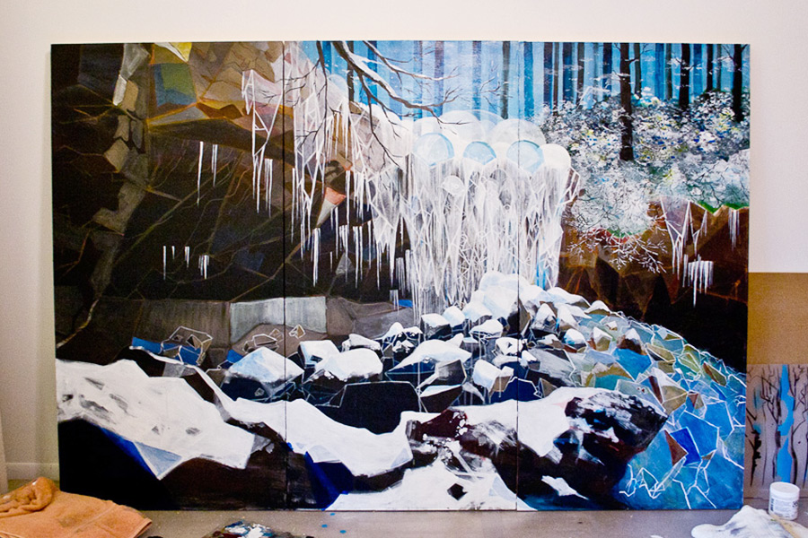
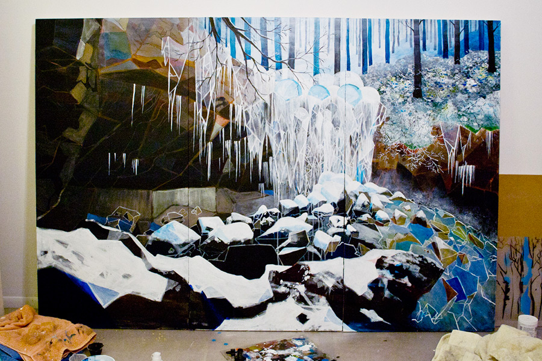

Lorem ipsum dolor sit amet, consectetur adipiscing elit. Quid ei reliquisti, nisi te, quoquo modo loqueretur, intellegere, quid diceret? Si enim ad populum me vocas, eum. Itaque ad tempus ad Pisonem omnes. Multa sunt dicta ab antiquis de contemnendis ac despiciendis rebus humanis; Duo Reges: constructio interrete. Quid nunc honeste dicit? Qua ex cognitione facilior facta est investigatio rerum occultissimarum.

- 
- 
- 
- 
- 
- 

Lorem ipsum dolor sit amet, consectetur adipiscing elit. Sumenda potius quam expetenda. Avaritiamne minuis? Bonum incolumis acies: misera caecitas. An eum discere ea mavis, quae cum plane perdidiceriti nihil sciat? Bona autem corporis huic sunt, quod posterius posui, similiora. Duo Reges: constructio interrete. Haeret in salebra. Quod ea non occurrentia fingunt, vincunt Aristonem; Vitiosum est enim in dividendo partem in genere numerare. Sequitur disserendi ratio cognitioque naturae;

